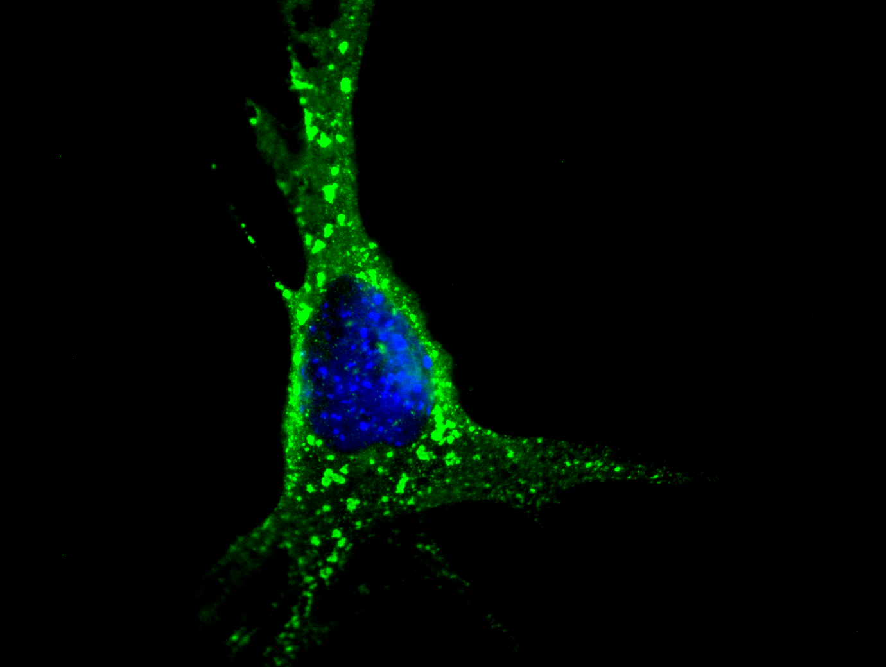

# Microscopy Blending Tool

This is a simple Python application for blending microscopy images of cell and kernel samples. The app allows you to load two grayscale images, assign them to the blue and green RGB channels, and generate a blended image for visualization.

This project was a quick Sunday project (not production-ready).

## Requirements

To install the necessary dependencies, you can run:

```
pip install -r requirements.txt
```

## Usage

1. Run the `app.py` script.
2. Load two grayscale microscopy images (e.g., cell and kernel).
3.    View and save the blended result.

## Screenshots

A preview of the application in action:




## License

This project is open-source and available under the MIT License.
